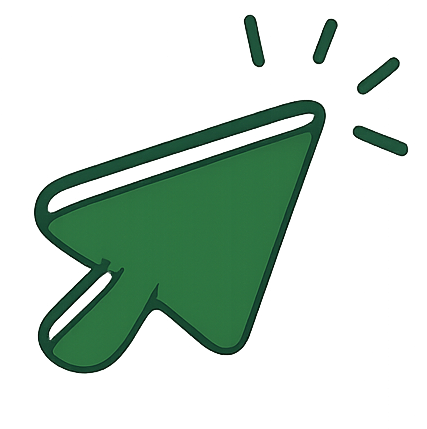

# 🚀 Welcome to KliqIN (formerly LOL URL)

<p align="center">
  
</p>

<p align="center">
  <b>SHORTEN. TRACK. DOMINATE.</b><br>
  <a href="https://lolurl.site/">🌐 Live Demo</a> •
  <a href="https://github.com/Rohit-Dnath/LOL-URL/issues">Issues</a> •
  <a href="https://github.com/Rohit-Dnath/LOL-URL/pulls">Pull Requests</a> •
  <a href="./CONTRIBUTING.md">Contributing</a> •
  <a href="./MIGRATION-STATUS.md">Migration Status</a> •
  <a href="./ROADMAP.md">Roadmap</a>
</p>

<p align="center">
  <a href="https://img.shields.io/badge/License-MIT-yellow.svg"></a>
  <a href="https://github.com/Rohit-Dnath/LOL-URL/pulls"></a>
  <a href="https://github.com/Rohit-Dnath/LOL-URL/issues?q=is%3Aissue+is%3Aopen+label%3A%22good+first+issue%22"></a>
  <a href="https://github.com/Rohit-Dnath/LOL-URL/commits/main"></a>
  <a href="https://lolurl.site/"></a>
</p>

> 🚀 **A minimal, powerful URL shortener with advanced analytics. Rebranded to KliqIN - competing with dub.co**

### 🌐 [Visit KliqIN Now](https://lolurl.site/)

---

## 🚧 Important: Migration in Progress

KliqIN is currently transitioning from Supabase to **Google OAuth + Prisma + Neon DB**. 

**Current Status:**
- ✅ Google OAuth authentication implemented
- ✅ Clean minimal UI redesign complete  
- ✅ Supabase completely removed
- ⚠️ Using localStorage for data (temporary)
- 🔜 Backend with Prisma + Neon DB coming soon

See [MIGRATION-STATUS.md](./MIGRATION-STATUS.md) for details.

---

## ✨ Features

| Feature                | Description                                              | Status |
|------------------------|----------------------------------------------------------|--------|
| URL Shortening         | Convert long URLs into sleek, shareable links            | ✅ Active (localStorage) |
| Google OAuth           | Secure sign-in with Google account                       | ✅ Active |
| Analytics Dashboard    | Track clicks, locations, devices, and browsers           | ✅ Active (localStorage) |
| QR Code Generator      | Download custom QR codes for your links                  | ✅ Active |
| Fast & Responsive      | Built with Vite + React for blazing performance          | ✅ Active |
| Minimal Design         | Clean, professional aesthetic inspired by dub.co         | ✅ Active |
| Custom Aliases         | Create branded short links                               | ✅ Active |
| Team Workspaces        | Collaborate with your team on links                      | 🔜 Coming |
| Prisma + Neon DB       | Serverless PostgreSQL backend                            | 🔜 Coming |
| Revenue Tracking       | Track conversions and revenue per link                   | 🔜 Coming |

---

## 🚀 Quick Start

### Prerequisites
- Node.js 18+ 
- Google OAuth Client ID ([Setup Guide](./GOOGLE-OAUTH-SETUP.md))

### Local Setup

1. **Clone the repository:**
   ```bash
   git clone https://github.com/Rohit-Dnath/LOL-URL.git
   cd LOL-URL
   ```
2. **Install dependencies:**
   ```bash
2. **Install dependencies:**
   ```bash
   npm install
   ```

3. **Set up Google OAuth:**
   - Get your Google OAuth Client ID from [Google Cloud Console](https://console.cloud.google.com/)
   - See [GOOGLE-OAUTH-SETUP.md](./GOOGLE-OAUTH-SETUP.md) for detailed setup guide
   
4. **Configure environment:**
   ```bash
   cp .env.example .env
   # Edit .env and add your VITE_GOOGLE_CLIENT_ID
   ```

5. **Run the development server:**
   ```bash
   npm run dev
   ```

6. Open [http://localhost:5173](http://localhost:5173) in your browser

**Note:** Currently using localStorage for data. Backend with Prisma + Neon DB coming soon!

---

## 🛠️ Usage

1. **Sign in** with your Google account
2. **Paste** a long URL into the input field
3. **Click** "Shorten Now" to generate a short link
4. **Download** the QR code or copy the link for sharing
5. **Track** clicks, locations, and devices in analytics dashboard
6. **Manage** all your links from one place

---

## 🤝 Contributing

We welcome contributions! KliqIN is actively being migrated to a modern stack.

**Priority Areas:**
- 🔥 Backend API with Prisma + Neon DB
- 🔥 Workspace/team collaboration features
- 🔥 Custom domains support
- UI improvements and bug fixes

### How to Contribute

1. Fork the repository
2. Create a new branch: `git checkout -b feature/your-feature-name`
3. Make your changes
4. Test thoroughly
5. Commit: `git commit -m 'Add: your feature description'`
6. Push: `git push origin feature/your-feature-name`
7. Open a [pull request](https://github.com/Rohit-Dnath/LOL-URL/pulls)

**Before contributing, please read:**
- [CONTRIBUTING.md](./CONTRIBUTING.md)
- [CODE_OF_CONDUCT.md](./CODE_OF_CONDUCT.md)
- [SECURITY.md](./SECURITY.md)
- [SUPPORT.md](./SUPPORT.md)
- [TROUBLESHOOTING.md](./TROUBLESHOOTING.md)
- [GOVERNANCE.md](./GOVERNANCE.md)
- [CODESTYLE.md](./CODESTYLE.md)
- [COMMUNITY-GUIDELINES.md](./COMMUNITY-GUIDELINES.md)

See [CONTRIBUTORS-GUIDE.md](./CONTRIBUTORS-GUIDE.md) for more ways to get involved!

---


## 🙏 Acknowledgements

Special thanks to the open-source community for providing the tools and libraries that made this project possible.
See [THIRD_PARTY_NOTICES.md](./THIRD_PARTY_NOTICES.md) for a full list of dependencies.

---

## 👥 Contributors

This project exists thanks to all the amazing people who contribute! 🙌

<a href="https://github.com/Rohit-Dnath/LOL-URL/graphs/contributors">
  
</a>

### 👑 Project Founder & Lead Maintainer

**[Rohit Debnath](https://github.com/Rohit-Dnath)** 👑 - *Creator & Admin*
- 🚀 Built LOL URL from the ground up
- 🛠️ Lead maintainer and project architect
- 💡 Vision: Making URL shortening fun and accessible for everyone

### 🌟 How to become a contributor:

- **🐛 Report bugs** - Found an issue? [Open an issue](https://github.com/Rohit-Dnath/LOL-URL/issues/new)
- **💡 Suggest features** - Have ideas? We'd love to hear them!
- **🔧 Submit pull requests** - Code contributions are always welcome
- **📚 Improve documentation** - Help make our docs better
- **🎨 Design improvements** - UI/UX enhancements
- **🧪 Testing** - Help us test new features and report issues
- **📢 Spread the word** - Share LOL URL with your network

### 🚀 Getting Started as a Contributor:

1. **Star the repo** ⭐ - Show your support!
2. **Fork the repository** - Create your own copy
3. **Check out** [CONTRIBUTING.md](./CONTRIBUTING.md) for detailed guidelines
4. **Look for** [good first issues](https://github.com/Rohit-Dnath/LOL-URL/issues?q=is%3Aissue+is%3Aopen+label%3A%22good+first+issue%22) to get started
5. **Join our community** - Connect with other contributors

### 💝 Recognition

Every contributor, no matter how big or small their contribution, is valued and recognized:

- **Code Contributors** - Listed in our contributors graph
- **Documentation Contributors** - Credited in relevant docs
- **Community Contributors** - Recognized in our community channels
- **Issue Reporters** - Acknowledged in issue resolutions
- **Feature Suggesters** - Credited when features are implemented

**Together, we're building something amazing!** 🚀

Want to see your name here? Check out our [CONTRIBUTORS-GUIDE.md](./CONTRIBUTORS-GUIDE.md) to get started!

---


## 📬 Contact & Support

For any inquiries, support, or suggestions:

- Open an [issue](https://github.com/Rohit-Dnath/LOL-URL/issues) for bugs or feature requests
- Email: **debnathrohit97@gmail.com**
- Website: [rohitdebnath.me](https://www.rohitdebnath.me/)
- See [SUPPORT.md](./SUPPORT.md) and [SECURITY_CONTACTS.md](./SECURITY_CONTACTS.md)

---

## 📢 Spread the Word

If you love LOL URL, star the repo, share it on social media, and tell your friends! Every ⭐ and share helps this project grow and reach more people.

---


## 📚 More Docs

- [FAQ.md](./FAQ.md)
- [GLOSSARY.md](./GLOSSARY.md)
- [ROADMAP.md](./ROADMAP.md)
- [RELEASE-NOTES.md](./RELEASE-NOTES.md)
- [AUTHORS.md](./AUTHORS.md)
- [MAINTAINERS.md](./MAINTAINERS.md)
- [FUNDING.md](./FUNDING.md)
- [BRANDING-GUIDE.md](./BRANDING-GUIDE.md)
- [ARCHITECTURE.md](./ARCHITECTURE.md)
- [DEMO.md](./DEMO.md)
- [SUPPORTED_PLATFORMS.md](./SUPPORTED_PLATFORMS.md)
- [MIGRATION-GUIDE.md](./MIGRATION-GUIDE.md)
- [TESTING-GUIDE.md](./TESTING-GUIDE.md)
- [CONTRIBUTORS-GUIDE.md](./CONTRIBUTORS-GUIDE.md)
- [CODESTYLE.md](./CODESTYLE.md)
- [GOVERNANCE.md](./GOVERNANCE.md)
- [THIRD_PARTY_NOTICES.md](./THIRD_PARTY_NOTICES.md)
- [SECURITY_CONTACTS.md](./SECURITY_CONTACTS.md)


### 📂 Docs Folder

| File | Description |
|------|-------------|
| [docs/database.md](./docs/database.md) | Database overview & ER diagram |
| [docs/schemas.md](./docs/schemas.md) | Table schemas (SQL) |
| [docs/api.md](./docs/api.md) | API endpoints |
| [docs/setup.md](./docs/setup.md) | Setup guide |
| [docs/architecture-diagram.md](./docs/architecture-diagram.md) | Architecture diagram (Mermaid) |

---

## ⚙️ Tech Stack

| Layer      | Technology         |
|------------|-------------------|
| Frontend   | React, Vite, Tailwind CSS |
| Backend    | Supabase (DB, Auth, Analytics) |
| Deployment | Vercel            |
| Docs       | Markdown, Mermaid |


---


<div align="center" style="margin-top: 2em; margin-bottom: 2em;">
  
  <h2 style="font-weight: 700; margin: 0.5em 0; font-size: 1.5em; background: linear-gradient(90deg,#00c6ff,#0072ff); -webkit-background-clip: text; -webkit-text-fill-color: transparent;">Hey, it's me, the developer of LOL URL,<br>Rohit Debnath</h2>
  <p style="font-size: 1.1em; color: #44; margin-bottom: 1em;">Connect with me:</p>
  <a href="https://www.linkedin.com/in/rohit-debnath/" target="_blank" style="margin: 0 10px;">
    
  </a>
  <a href="https://x.com/r0dth" target="_blank" style="margin: 0 10px;">
    
  </a>
  <p style="margin-top: 1.5em; font-size: 1.1em; color: #666;">Made with ❤️ by the open source community.</p>
</div>

---

**Shorten, Share, Track, Laugh! 😄**
