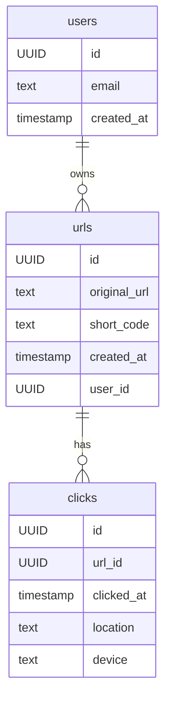

# Database Overview

This document describes the database structure and storage for LOL URL.

## Supabase Tables

### urls
- id (UUID, PK)
- original_url (text)
- short_code (text, unique)
- created_at (timestamp)
- user_id (UUID, FK)

### clicks
- id (UUID, PK)
- url_id (UUID, FK)
- clicked_at (timestamp)
- location (text)
- device (text)

### users
- id (UUID, PK)
- email (text, unique)
- created_at (timestamp)

## Entity Relationship Diagram

See [docs/schemas.md](./schemas.md) for detailed schema definitions.
